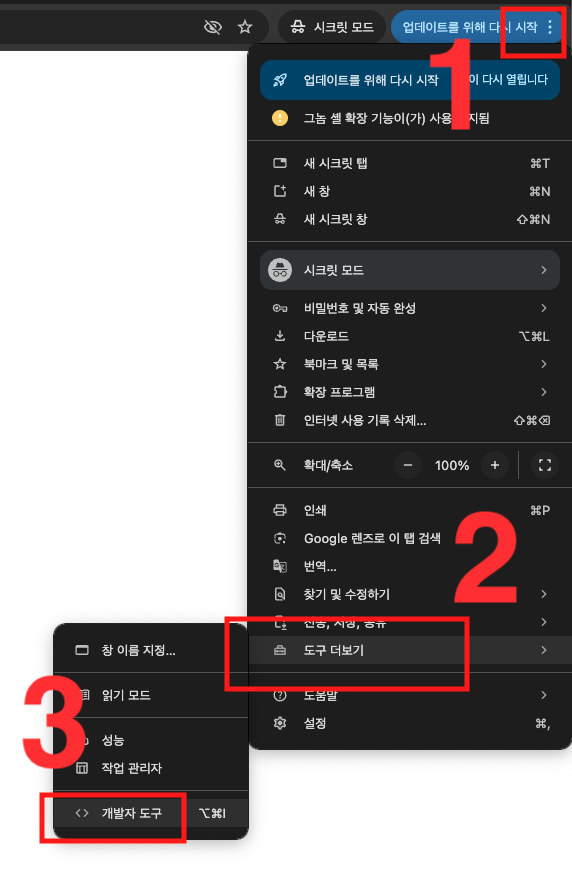

# Remove Adblock Thing with Downloader !

> YouTube 광고 차단 + 영상 다운로드 유저스크립트

> YouTube의 광고 시스템과 애드블록 감지 메커니즘을 분석하여, 다층 방어 구조로 광고를 차단하고 영상 다운로드 기능을 제공하는 아주 순수한 연구 목적의 프로젝트입니다.


> **이 프로젝트는 개인을 위하여 사용해야 하며 YouTube 서비스 이용약관을 준수하여 사용하시기 바랍니다. 이 외의 용도로 사용할 경우 책임을 지지 않습니다.**

---

## 주요 기능

| 기능 | 설명 |
|------|------|
| 광고 차단 | 서버 요청 인터셉트 + 응답 데이터 제거 + CSS 즉시 숨김 |
| 광고 스킵 | 뚫고 온 광고를 자동 감지하여 즉시 건너뜀 |
| 팝업 차단 | "광고 차단기 사용 중" 감지 우회 및 팝업 제거 |
| 영상 다운로드 | YouTube 내부 API를 통해 스트림 URL을 추출하여 다운로드 |

---

## Quick Start



또는 YouTube 페이지에서 `F12` → **Console** 탭에 아래를 붙여넣고 Enter.

```
fetch('https://raw.githubusercontent.com/RuffaloLavoisier/mypipe/main/Youtube-Ad-blocker-Reminder-Remover.user.js').then(r=>r.text()).then(copy)
```

그리고 `Ctrl + V` 를 통해 붙여넣기

## 사용 방법 (Chrome)

### 1단계: 스크립트 복사

`Youtube-Ad-blocker-Reminder-Remover.user.js` 파일의 내용을 복사합니다.

### 2단계: 개발자 콘솔에 붙여넣기


또는 YouTube 페이지에서 `F12` → **Console** 탭에 붙여넣고 Enter.


### 3단계: 영상 다운로드

영상 플레이어 아래에 **Download** 패널이 나타납니다. 버튼을 클릭하세요.


새 탭에서 영상이 열리면, 브라우저 메뉴의 **다운로드**를 통해 저장합니다.


---

## Credits

- Original: [TheRealJoelmatic/RemoveAdblockThing](https://github.com/TheRealJoelmatic/RemoveAdblockThing)
- Contributor: [RuffaloLavoisier](https://github.com/RuffaloLavoisier)
