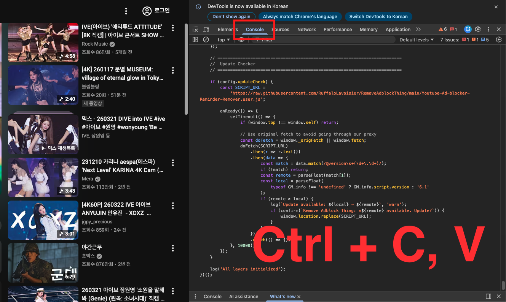
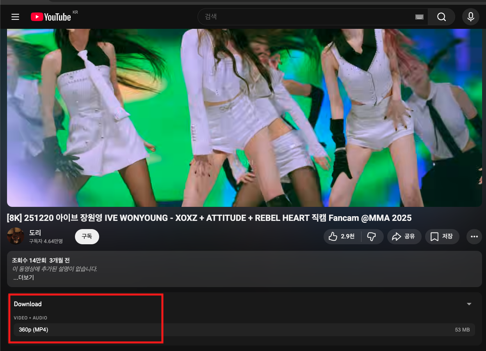
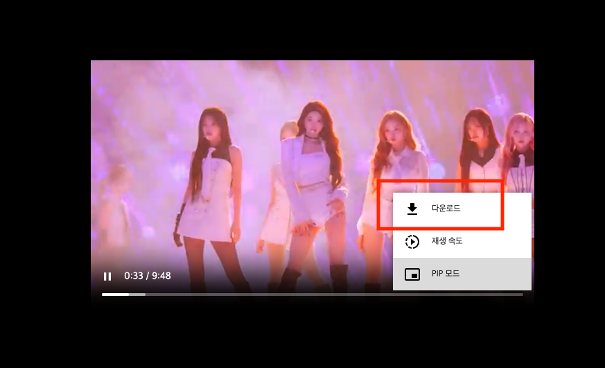

# Remove Adblock Thing with Downloader!

> YouTube ad blocker + video download userscript

A research project that analyzes YouTube's ad delivery system and adblock detection mechanisms, providing multi-layer ad blocking and video download functionality.

> **This project is intended for personal use only. Please comply with YouTube's Terms of Service. The authors are not responsible for any misuse.**

---

## Features

| Feature | Description |
|---------|-------------|
| Ad Blocking | Server request interception + response data stripping + instant CSS hiding |
| Ad Skipping | Auto-detects and instantly skips ads that slip through |
| Popup Blocking | Bypasses "ad blockers are not allowed" detection and removes popups |
| Video Download | Extracts stream URLs via YouTube's internal API for direct download |

---

## How to Use (Chrome)

### Step 1: Copy the Script

Copy the contents of `Youtube-Ad-blocker-Reminder-Remover.user.js`.

### Step 2: Paste into Developer Console

On a YouTube page, press `F12` → **Console** tab → paste → Enter.

### Step 3: Download Video

A **Download** panel appears below the video player. Click the button.

The video opens in a new tab. Use the browser's **Download** option to save it.

---

## Credits

- Original: [TheRealJoelmatic/RemoveAdblockThing](https://github.com/TheRealJoelmatic/RemoveAdblockThing)
- Contributor: [RuffaloLavoisier](https://github.com/RuffaloLavoisier)
